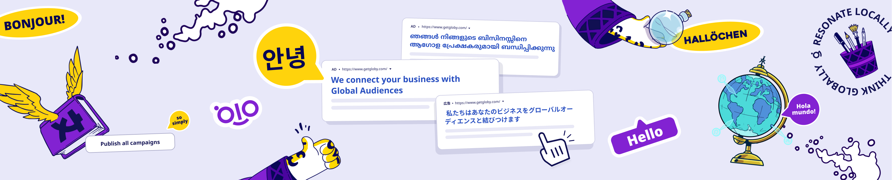

# Hi there 👋

I am product-minded software engineer from Argentina 🇦🇷

### 👀 Abut me

- 🔭 I work at [GetGloby](https://www.getgloby.ai/)
- 🌱 I am actively learning about LLMs and artificial intelligence
- 👥 I love to collaborate on side projects

 

### 🛠️ Weekend Projects

- Coming Soon!

### 📄 Published Papers

- [Game Theory and the Dynamics of Attackers-Defenders in Cybersecurity: A Literature Review (Original in Spanish)](http://dx.doi.org/10.13140/RG.2.2.25610.27841) - A literature review exploring how game theory can be applied as an analytical framework to model and improve cybersecurity strategies between attackers and defenders.

### 📚 Technical Articles

- [Working on the right problem dominates speed of execution](https://medium.com/@jjdeleon/working-on-the-right-problem-dominates-speed-of-execution-88214f156b98)
- [Why Anti-Patterns teach us more than Best Practices](https://medium.com/@jjdeleon/why-anti-patterns-teach-us-more-than-best-practices-a85bbb1e194b)
- [Technical debt: The double-edged sword of Software Engineering](https://medium.com/@jjdeleon/technical-debt-the-double-edged-sword-of-software-engineering-0ae4ba3961c5)

### 🔧 Technologies & Tools

#### Frontend

#### Backend

#### Testing

#### Infrastructure & Tools

